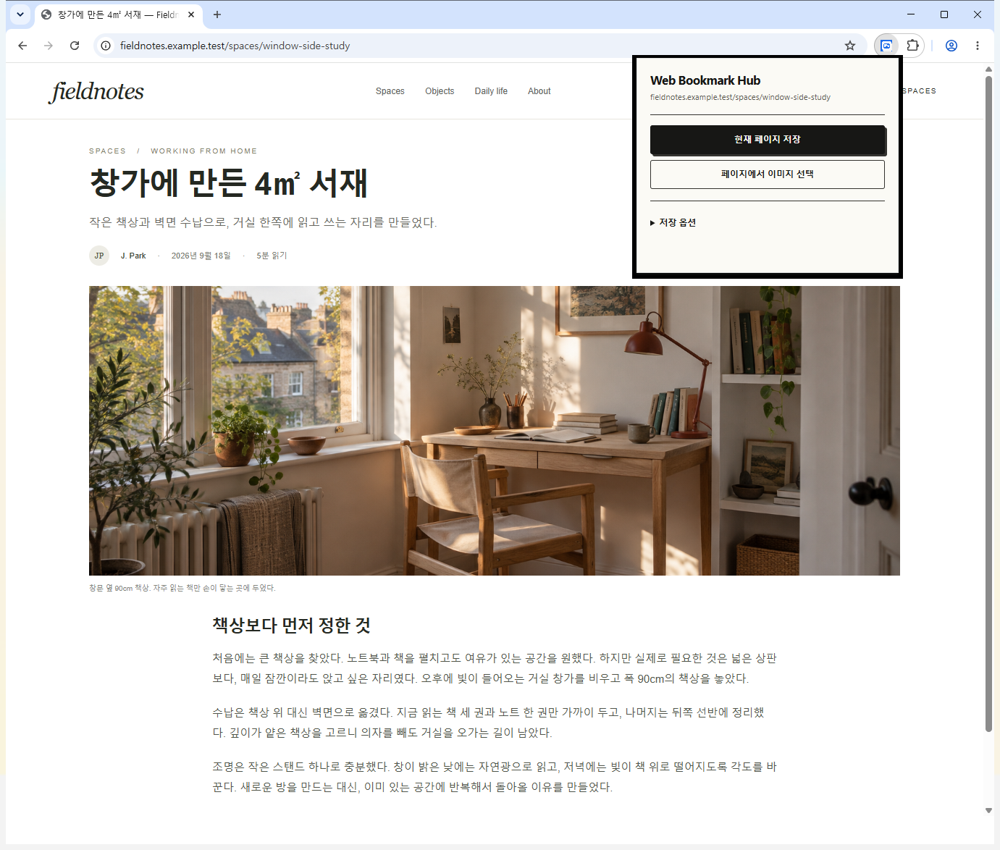
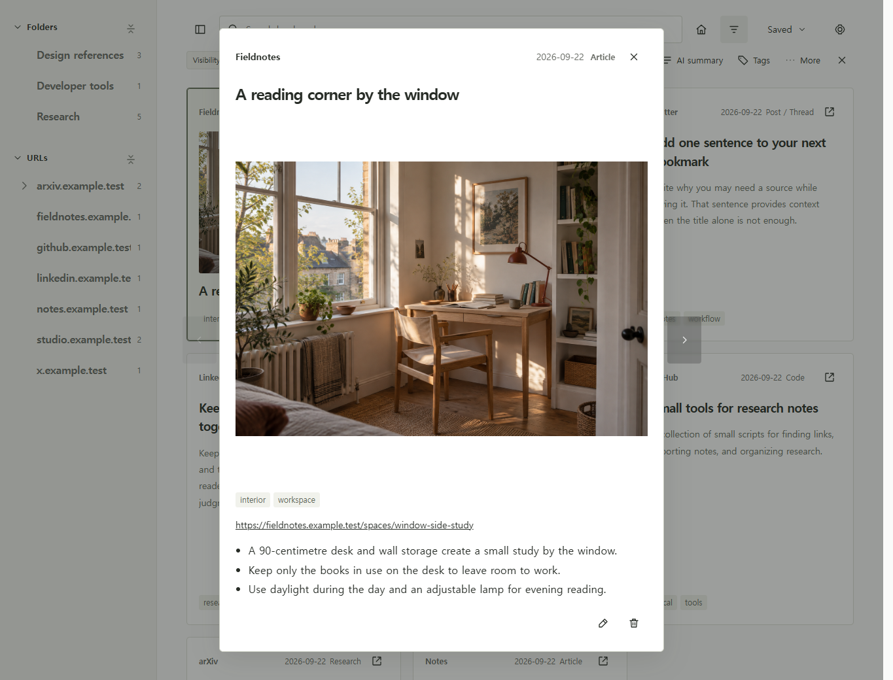
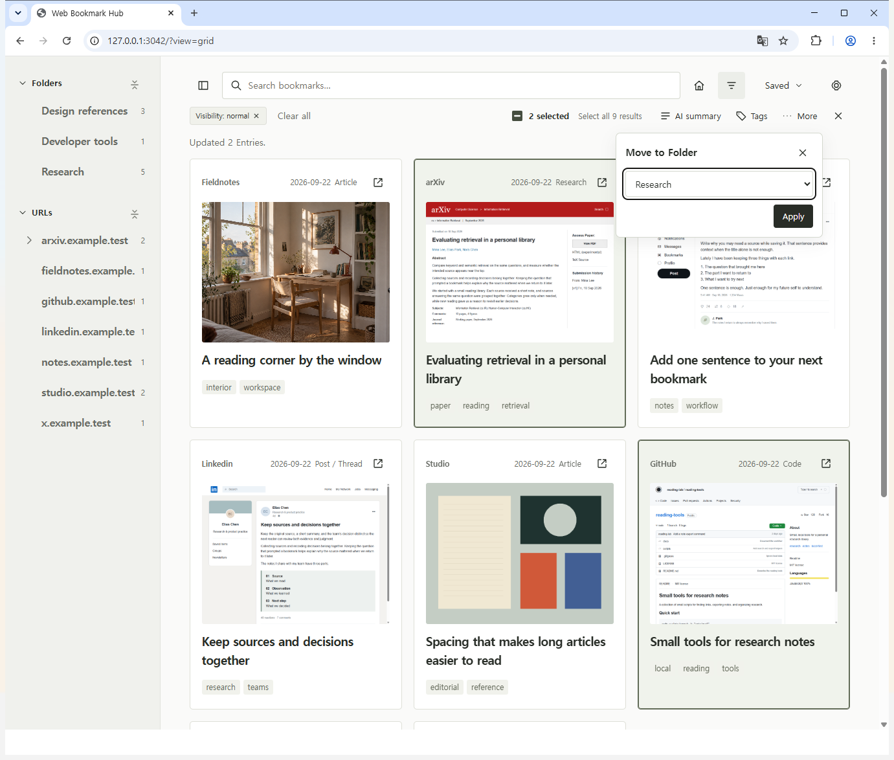
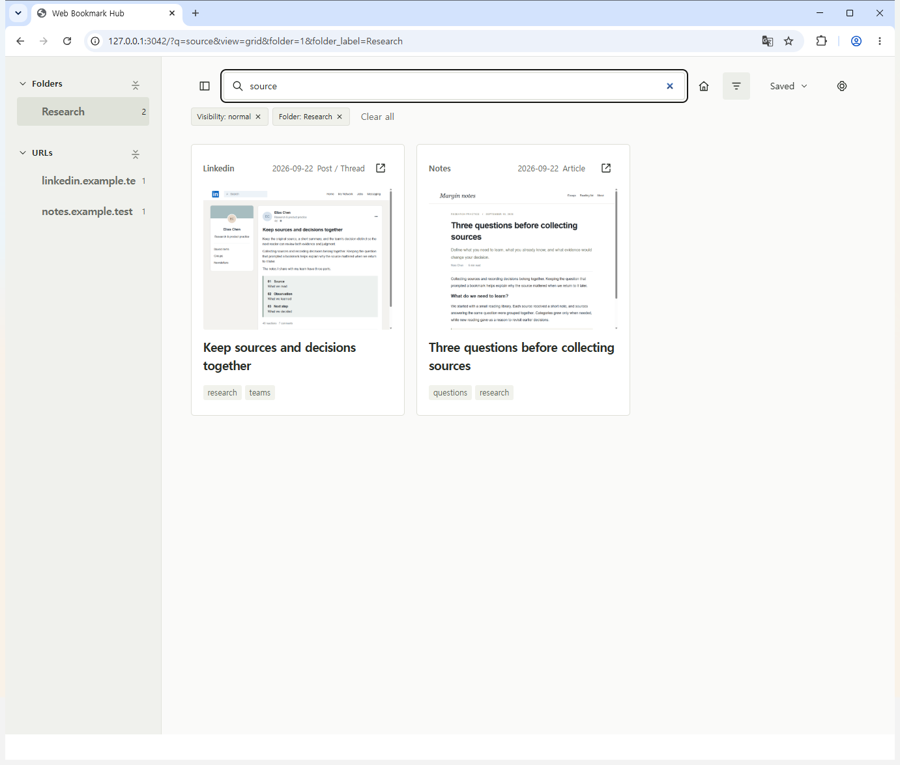

# Web Bookmark Hub

[한국어](README.md) · English

A guide and template for people who save information from many different places.
Use Codex to pick the parts you need and adapt them to your own workflow.

## Key features

### 1. Save the page you are reading

Keep URLs from blog posts, arXiv papers, and X or LinkedIn posts in one place. Click **현재 페이지 저장** (Save current page) in the Chrome extension, or press **Ctrl+Shift+E**.

The shortcut saves the URL first, then starts organization if the entry allows AI processing (**Normal**) and has no summary. The popup button saves the URL only; you can run **AI summary** from the app later.

### 2. Add a title, summary and thumbnail

Automatic organization currently uses **Luna (`gpt-5.6-luna`) / reasoning effort `max`**. It uses evidence from the saved item's page title, main text or paper abstract with these criteria:

- **Title:** Describe the subject briefly and concretely. Preserve an existing authored title.
- **Summary:** Explain the exact article or post in one Korean sentence of 20–240 characters. Do not add unsupported facts.
- **Thumbnail:** The app retrieves a representative image or video poster for that item. It prefers an existing local image; when the shortcut has no image candidate, it uses a page snapshot.

Adapt the title and summary criteria in the [summary prompt](enrichment/ai-summary-prompt.md) to your own needs, including the output language. The [Codex guide](docs/CODEX_GUIDE.md) identifies where to change image selection.

### 3. Set rules for each website

In **Rules**, choose a content type, default tags and AI eligibility for a site or URL path. For example, configure arXiv paper pages as **Research + paper**, and X or LinkedIn posts as **Post + ideas**.

Page saves and selected-image saves can have different rules. Preview the affected entries before applying a rule to existing material. Work with Codex to change the extraction code when a site needs different text or image selection.

### 4. Organize with folders and tags

Group sources into folders and use tags for overlapping topics. Select multiple cards, then use **Tags**, or **More → Move to Folder → Apply**, to organize them together.

Beyond a rule's default tags, folder and tag reorganization is a manual action or a separate task you give Codex.

### 5. Find sources again

Combine search terms with folders, tags and content types. Browse images or use a list, open a card to review its summary and notes, and return to the original source.

## Get started

Give Codex this GitHub link and describe what you need:

> https://github.com/simpleusername96/web-bookmark-hub-template
>
> Build a source library for [my use case] from this project. Read AGENTS.md and docs/CODEX_GUIDE.md, keep and adapt [the features I need], and prepare local startup and the Chrome extension connection.

Automatic organization requires a signed-in Codex CLI. New libraries default to **Private**; set the relevant site rules or **Rules → Defaults** to **Normal** for entries you want AI to process.

[Codex guide: features, rationale and customization](docs/CODEX_GUIDE.md) · [Setup](docs/SETUP.md) · [MIT](LICENSE)
