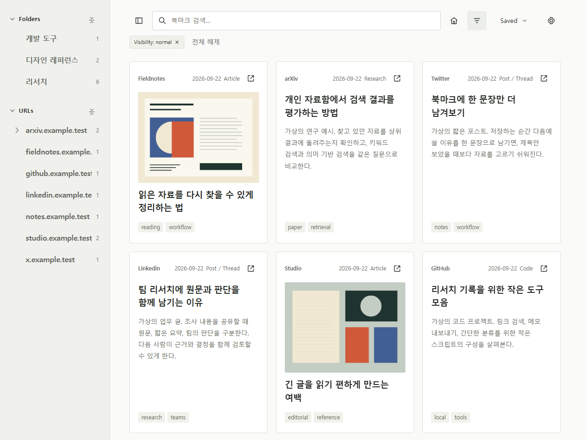
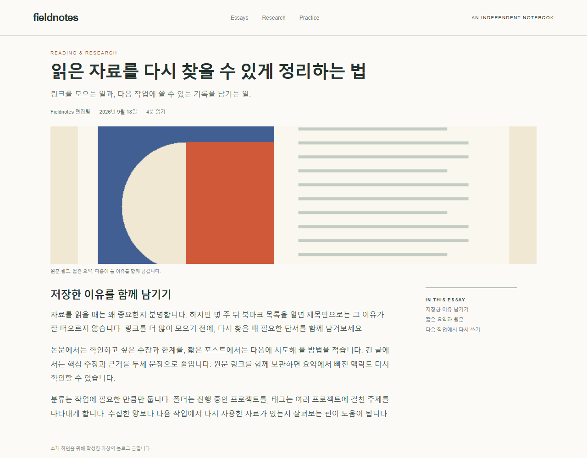
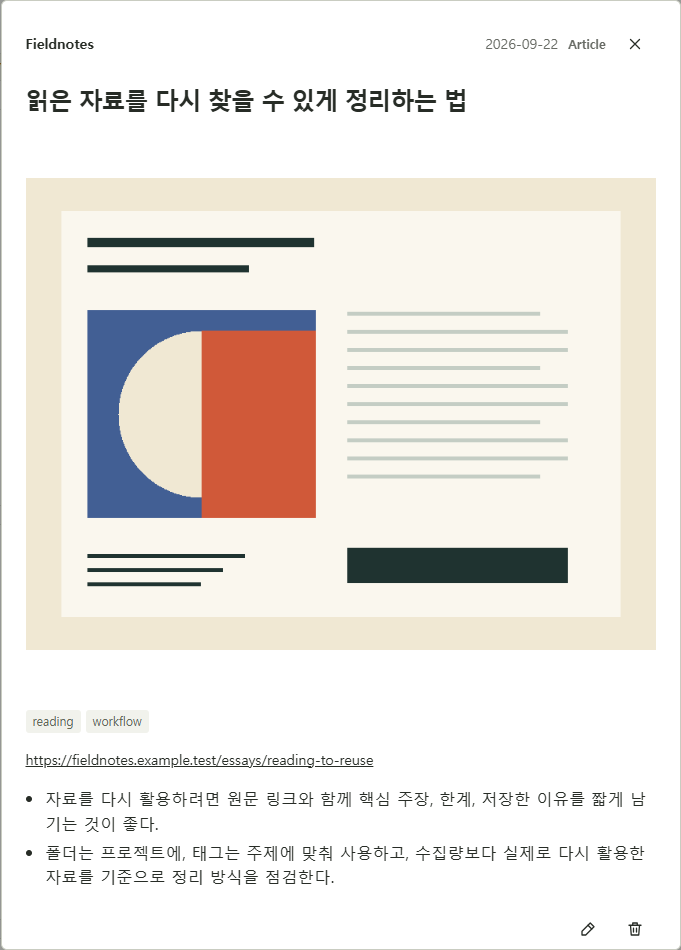

# Web Bookmark Hub

한국어 · [English](README.md)

웹에서 읽은 자료를 저장하고, Codex로 요약하고, 필요할 때 다시 찾는 앱입니다.

블로그 글, 논문, 포스트, 코드, 시각 자료를 하나의 로컬 자료함에 모읍니다. Chrome 확장 프로그램을 연결하고 AI 처리를 허용하면, 읽고 있는 페이지에서 **Ctrl+Shift+E**를 눌러 저장과 Codex 요약을 시작할 수 있습니다.

이 저장소는 **Codex와 함께 사용하고 개발하는 템플릿**입니다. 현재 앱을 기반으로 화면, 저장할 정보, 정리 방식을 본인의 작업에 맞게 바꾸면 됩니다.



*모든 스냅샷은 별도로 만든 가상 자료함을 사용했습니다. 글, `.example.test` 주소, 이미지, 요약은 소개를 위해 작성한 예시입니다. 개인 데이터나 실제 AI 실행 결과가 아니며, 폴더와 태그도 미리 구성했습니다.*

## 읽던 자료가 저장된 기록이 되기까지

**1. 웹에서 자료를 읽습니다.** 아래는 대표 이미지와 본문이 있는 가상의 블로그입니다.



**2. Ctrl+Shift+E로 저장합니다.** 설정을 마치면 단축키가 URL을 먼저 저장합니다. 요약이 없는 Normal 항목에는 확장 프로그램이 현재 페이지의 제한된 본문 정보와 화면 이미지를 전달하고, 로컬 요약 실행기가 Codex 작업을 시작합니다.

**3. 원문과 요약을 함께 확인합니다.** 비어 있는 제목을 채우고, 짧은 요약과 가져올 수 있는 대표 미리보기를 남길 수 있습니다. 기존에 작성한 제목과 메모는 유지하며, 메모가 없는 경우에는 요약을 Notes에도 추가합니다.



저장한 자료는 검색하고, 폴더에 넣고, 태그를 붙여 다음 작업에 활용합니다. 폴더 배치와 태그는 직접 정하거나 Codex에 요청하는 작업입니다. 단축키가 모든 자료를 자동으로 분류하지는 않습니다.

## 이런 자료를 모을 수 있습니다

| 출처 | 활용 예시 |
| --- | --- |
| arXiv | 논문 링크와 함께 핵심 주장, 확인할 한계를 짧게 기록합니다. |
| X / Twitter | 다시 살펴볼 아이디어나 방법이 있는 개별 포스트를 저장합니다. |
| LinkedIn | 업무에 도움이 되는 포스트와 글을 다른 조사 자료와 함께 정리합니다. |
| 블로그와 문서 | 프로젝트에 필요한 설명, 가이드, 참고 자료를 모읍니다. |
| GitHub와 시각 자료 | 관련 도구와 선택한 미리보기 이미지를 같은 자료함에서 관리합니다. |

현재 페이지 저장은 브라우저에서 읽고 있는 내용을 활용하는 범용 흐름입니다. 위 목록은 활용 예시이며, 모든 사이트에서 전체 내용을 추출한다는 뜻은 아닙니다. 로그인 여부, 접힌 스레드, 페이지 구조에 따라 요약에 사용할 수 있는 내용이 달라집니다. 스냅샷은 해당 출처의 유형을 가상 데이터로 보여주며, 실제 서비스별 동작을 검증한 화면은 아닙니다.

## 설치부터 첫 저장까지

**Node.js 24.19.0 이상**, Git, Chrome이 필요합니다. 자동 요약에는 설치와 로그인을 마친 Codex CLI도 필요합니다. 앱 자체에는 별도의 npm 의존성 설치나 빌드 과정이 없습니다. 주 개발·검증 환경은 Windows이며, macOS와 Linux에서는 같은 수준의 전체 흐름 검증을 거치지 않았습니다.

### 1. 로컬 앱 실행

GitHub의 **Use this template**으로 본인 저장소를 만들거나, 이 저장소를 복제합니다.

```sh
git clone https://github.com/simpleusername96/web-bookmark-hub-template.git
cd web-bookmark-hub-template
node registry-server.js --host 127.0.0.1 --port 3042 --db ./data/registry.sqlite3
```

터미널을 켜 둔 상태로 [로컬 앱](http://127.0.0.1:3042/)을 엽니다. 새 데이터베이스는 빈 자료함으로 시작합니다. 확장 프로그램은 **127.0.0.1:3042**에 연결하도록 되어 있으므로 이 주소와 포트를 사용하세요.

### 2. Codex CLI 설치와 로그인

```sh
npm install -g @openai/codex
codex
```

로그인을 마친 뒤 요약을 실행하세요. Codex 데스크톱 앱을 설치하는 것만으로 이 앱이 사용하는 CLI가 설치되지는 않습니다. 설치와 인증 방법은 [공식 Codex CLI 안내](https://learn.chatgpt.com/docs/codex/cli)를 참고하세요.

**Windows**의 현재 요약 실행기는 Node 실행 파일 옆의 `node_modules/@openai/codex/bin/codex.js`에 npm으로 설치된 CLI가 있다고 가정합니다. 서버와 CLI에 같은 Node 설치를 사용하세요. npm 전역 설치 경로를 바꾸었거나 독립 설치판을 사용한다면 [`server/ai-url-summary.js`](server/ai-url-summary.js)의 `codexInvocation`을 조정해야 할 수 있습니다. macOS/Linux에서는 PATH의 `codex`를 실행합니다.

현재 기본값은 `gpt-5.6-luna`, reasoning effort `max`이며 해당 모델을 사용할 수 있는 계정이 필요합니다. 기본 요약 언어는 UI 언어와 관계없이 **한국어**입니다. 언어와 요약 방식은 [`enrichment/ai-summary-prompt.md`](enrichment/ai-summary-prompt.md)에서, 모델과 추론 강도는 [`registry/constants.js`](registry/constants.js)에서 바꿀 수 있습니다.

### 3. Chrome 확장 프로그램 연결

1. `chrome://extensions`에서 **개발자 모드**를 켭니다.
2. **압축해제된 확장 프로그램을 로드합니다**를 누르고, `manifest.json`이 있는 저장소 루트를 선택합니다.
3. 확장 프로그램 팝업에서 **Web UI에서 연결**을 누릅니다.
4. 앱의 **설정 → Chrome**에서 **연결 승인**을 누릅니다.
5. `chrome://extensions/shortcuts`에서 단축키를 확인합니다. 기본값은 **Ctrl+Shift+E**, macOS에서는 **Command+Shift+E**입니다.

### 4. 새로 저장할 자료의 AI 처리 허용

새 데이터베이스의 기본값은 **Private**이며, 이 상태에서는 AI 처리를 하지 않습니다.

톱니바퀴 아이콘 → **Rules → Defaults**에서 **Visibility**를 **Normal (local)**로 바꾸고 저장하세요. Normal은 앱의 AI 처리를 허용한다는 뜻이며, 자료를 외부에 공개하는 설정이 아닙니다. 일치하는 사이트·경로 규칙이 있으면 그 규칙이 기본값보다 우선합니다.

이 설정은 **앞으로 저장하는 자료**에 적용됩니다. 이미 Private으로 저장한 항목은 해당 항목을 Normal로 변경한 뒤 **AI summary**를 직접 실행하세요. 기본값을 바꾸어도 기존 항목은 바뀌지 않습니다.

### 5. 실제 페이지 저장

Chrome에서 글을 열고 **Ctrl+Shift+E**를 누릅니다. URL이 먼저 저장되고, 요약이 없는 AI 처리 가능 항목에 Codex 작업이 이어집니다. 진행 상태는 **설정 → AI**에서 확인합니다. 자료함의 카드를 더블클릭하거나, 선택한 뒤 Enter를 누르면 상세 화면이 열립니다.

확장 프로그램 팝업의 **현재 페이지 저장**과 앱의 **Add URL**은 링크만 저장하며 이 자동 요약 흐름을 시작하지 않습니다. 요약을 재시도하거나 갱신하려면 항목을 선택하고 **AI summary**를 실행하세요.

## 예시 데이터로 먼저 살펴보기

Codex를 연결하기 전에 앱을 둘러보려면 위 서버를 종료한 뒤 다음을 실행합니다.

```sh
node scripts/seed-demo.js
node registry-server.js --host 127.0.0.1 --port 3042 --db ./data/demo.sqlite3
```

[로컬 앱](http://127.0.0.1:3042/)을 열면 가상 자료 20건, 폴더 4개, 생성된 미리보기 이미지가 들어 있는 별도 예시 자료함을 볼 수 있습니다. 위 스냅샷의 소규모 자료함과는 구성이 다릅니다. 요약은 미리 작성한 예시이며, `.example.test` 주소는 실제 사이트로 연결되지 않습니다. 기존 데이터베이스는 덮어쓰지 않으며, 둘러보는 데 모델 호출은 필요하지 않습니다.

본인 자료함으로 돌아가려면 데모 서버를 종료하고 첫 실행 명령의 `registry.sqlite3`로 다시 실행하세요.

## Codex와 함께 바꾸기

본인 저장소를 Codex에서 열고 필요한 작업을 요청합니다. 예를 들면 다음과 같습니다.

> 이번 주에 저장한 Normal 자료 중 메모가 없는 항목을 요약해줘. 리서치 프로젝트에 맞는 폴더도 제안해줘. 내가 쓴 메모는 유지해줘.

> 이 템플릿을 디자인 레퍼런스 자료함으로 바꿔줘. 원문 링크는 유지하고, 내가 필요한 정보 항목을 추가해줘.

로컬 Registry CLI, HTTP API, 에이전트 지침, 링크 정리 스킬이 포함되어 있습니다. Codex가 요청받은 자료 정리 작업에 이를 사용하고, 앱 코드도 함께 수정할 수 있습니다. 별도 MCP 서버, 출처 구독 피드, 예약 수집은 아직 구현되어 있지 않습니다.

| 바꾸고 싶은 부분 | 시작할 위치 |
| --- | --- |
| 화면, 검색, 탐색 | [`web/`](web/) |
| 자료, 폴더, 태그, 데이터 규칙 | [`registry/`](registry/) |
| 로컬 API와 인증 | [`server/`](server/) |
| 브라우저 저장 | [`extension/`](extension/), [`profiles.js`](profiles.js), [`popup.js`](popup.js) |
| 요약 언어와 지침 | [`enrichment/ai-summary-prompt.md`](enrichment/ai-summary-prompt.md) |
| 가상 예시 데이터 | [`examples/`](examples/), [`scripts/seed-demo.js`](scripts/seed-demo.js) |

동작을 바꾸기 전에 [프로젝트 계약](docs/PROJECT.md)을 읽고, 수정 후 `node scripts/verify.js`로 확인하세요.

## 데이터와 저장 방식

자료함은 Git에서 제외된 `data/` 아래의 로컬 SQLite에 저장됩니다. 백업하거나 옮길 때는 데이터베이스와 같은 위치의 `.data` 디렉터리를 함께 보관하세요. 저장한 링크, 내보낸 자료, 인증 정보, 미리보기를 Git에 추가하지 마세요.

앱은 링크, 편집 가능한 메타데이터, 제한된 미리보기를 저장합니다. 웹페이지 전체나 PDF·오디오·동영상을 오프라인 사본으로 보관하지 않습니다. 선택 이미지 저장은 참조 보관이 기본이며, 로컬 미리보기 복사는 선택 사항입니다. AI 처리를 요청하면 관련 페이지 정보가 Codex를 통해 전달됩니다. 자료함이 로컬에 있다는 것이 AI도 오프라인으로 실행된다는 뜻은 아닙니다.

**Private**은 앱이 제공하는 AI 흐름에서 해당 항목을 제외합니다. 파일 접근 권한이 있는 로컬 에이전트까지 격리하는 기능은 아닙니다.

## 잘되지 않을 때

| 증상 | 확인할 것 |
| --- | --- |
| 확장 프로그램이 연결되지 않음 | 서버가 `http://127.0.0.1:3042`에서 실행 중인지 확인하고 설정 → Chrome에서 연결을 승인합니다. |
| 단축키가 반응하지 않음 | `chrome://extensions/shortcuts`의 충돌 여부를 확인하고 일반 HTTP(S) 페이지에서 실행합니다. |
| 링크만 저장되고 요약이 없음 | Visibility, 일치하는 Rules, Codex 로그인, 설정 → AI를 확인합니다. 팝업 저장은 요약을 시작하지 않으며, 요약이 있는 항목도 자동 재실행하지 않습니다. |
| 저장한 항목이 보이지 않음 | 초기 화면은 Normal만 표시합니다. 필터를 해제하거나 Private을 선택합니다. |
| Windows에서 Codex CLI를 시작하지 못함 | 위의 npm 설치 위치를 확인하고 서버와 CLI가 같은 Node 설치를 사용하는지 확인합니다. |
| UI 언어를 바꾸어도 요약 언어가 그대로임 | 요약 프롬프트를 수정합니다. 두 언어 설정은 서로 독립적입니다. |

[MIT 라이선스](LICENSE). 개인 도구를 만들기 위한 템플릿이며, 호스팅 서비스나 OpenAI의 공식 제품이 아닙니다.
