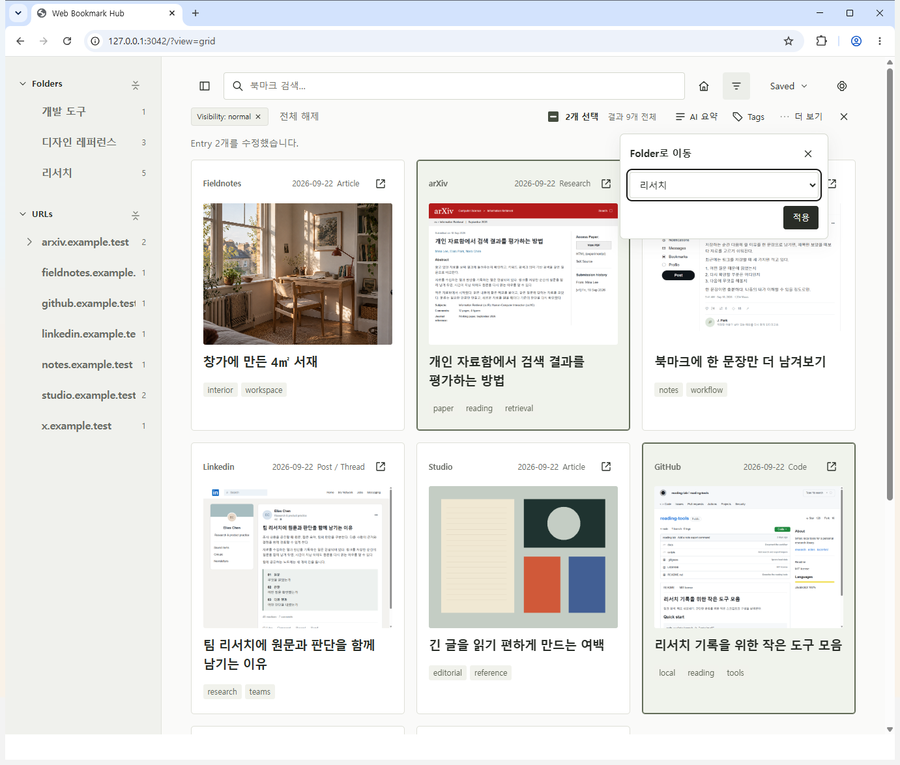
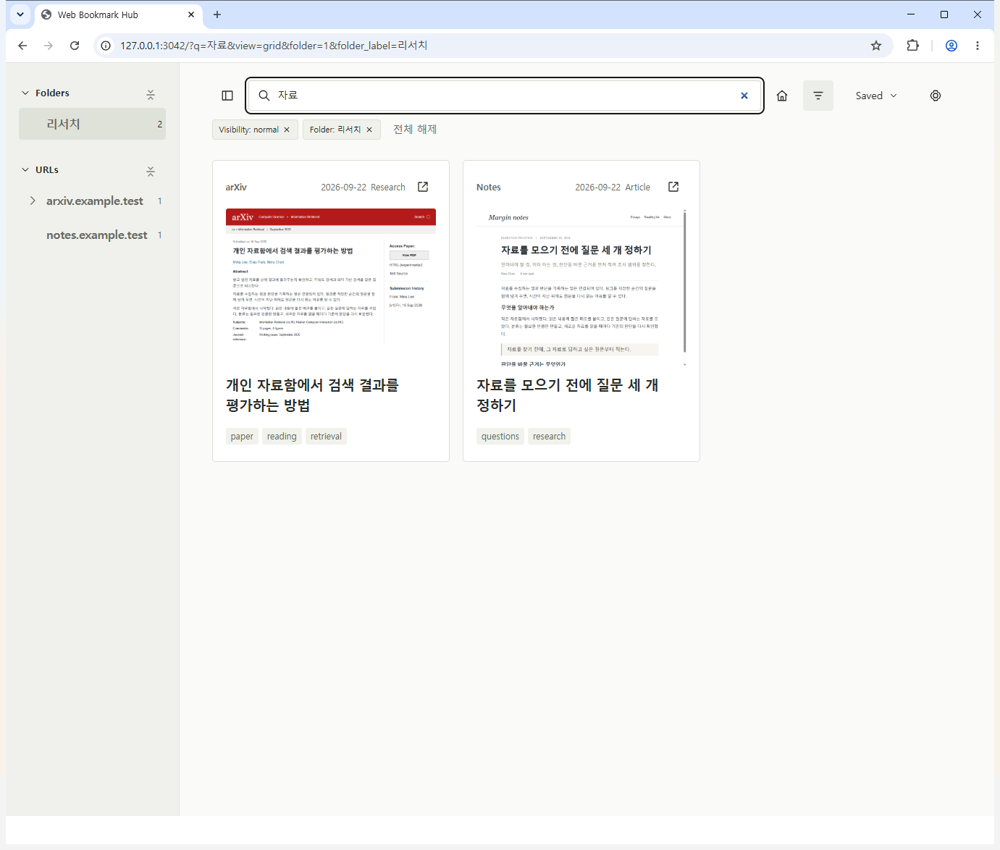

# Web Bookmark Hub

한국어 · [English](README.md)

다양한 곳에서 정보를 저장하는 사람들을 위한 가이드라인이자 템플릿입니다.
Codex와 함께 필요한 기능만 골라, 사용 목적에 맞게 수정해 사용하세요.

## 주요 기능

**1. 웹 자료 저장** — Chrome 확장 프로그램에서 **현재 페이지 저장**. **Ctrl+Shift+E**로 저장하면 Codex 정리까지 이어집니다.

**2. Codex로 정리** — 제목·요약과 대표 이미지 또는 페이지 스냅샷을 남깁니다. 카드를 열어 요약과 원문을 확인합니다.

**3. 폴더·태그로 분류** — 자료 선택 → **Tags** 또는 **더 보기 → Folder로 이동** → **적용**.

**4. 필요한 자료 다시 찾기** — 검색어·폴더·태그를 함께 사용합니다.

## 시작하기

**Use this template**으로 저장소를 만든 뒤 Codex에 요청하세요: “docs/SETUP.md를 읽고 실행·확장 프로그램 연결을 준비해줘. [나의 용도]에 맞게 수정하고 싶어.”

[설정 안내](docs/SETUP.md) · [MIT](LICENSE)
