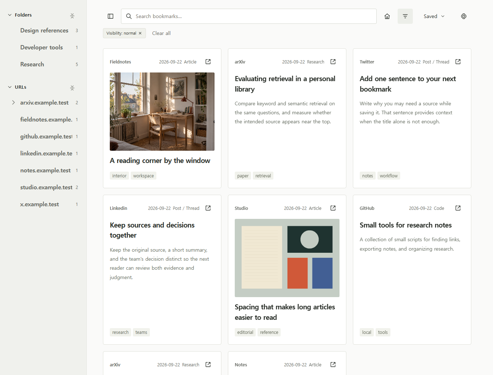
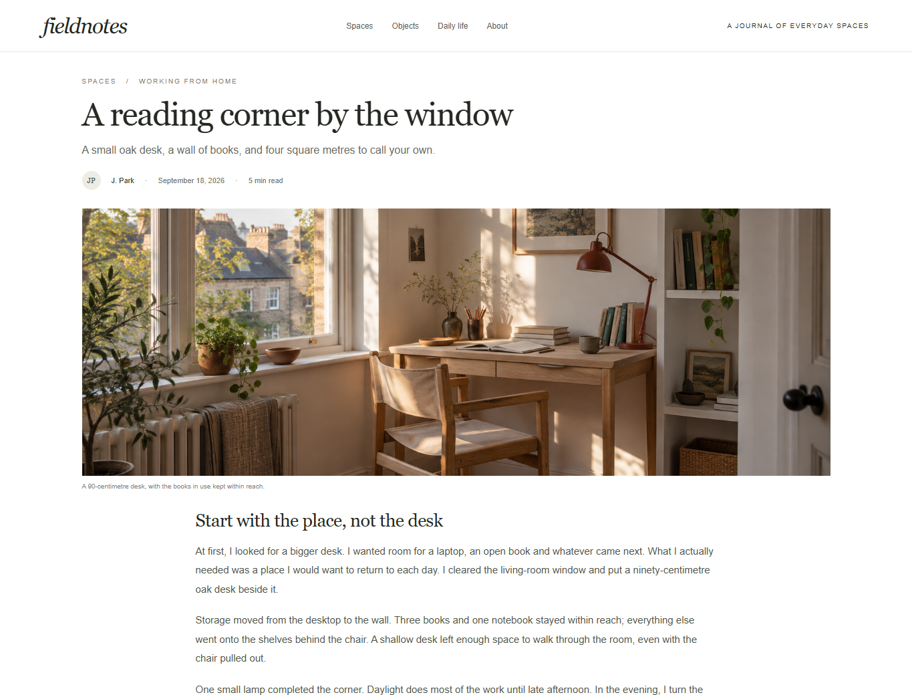
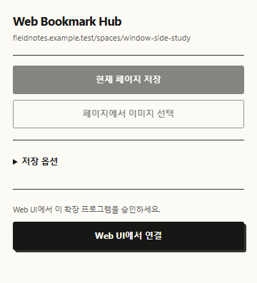
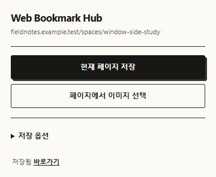

# Web Bookmark Hub

English · [한국어](README.ko.md)

**A template for building your own web research tool with Codex.**

Collect what you read on blogs, arXiv, X, LinkedIn and elsewhere. Save links, summarize them, and find them through search, folders and tags. Use this app as a starting point, then ask Codex to adapt its features and interface to your work.

## Start with Codex

Choose **Use this template**, clone your repository, and open it in Codex. Tell it what you want to build:

> Adapt this template for [paper research / design references / work research].
> Read the project instructions and docs/SETUP.md, prepare the environment, start the app, and guide me through connecting the Chrome extension.
> Then help me choose the fields, organization and interface for my workflow.

## Save while reading

Press **Ctrl+Shift+E** on a page to save it and start a Codex summary. On macOS, use **Command+Shift+E**.

| The page you are reading | Open it in your library |
| --- | --- |
|  |  |

Automatic summaries require a signed-in Codex CLI and **Rules → Defaults → Normal (local)**. Private entries are excluded from AI processing.

## Chrome extension controls

Open `chrome://extensions` → **Developer mode** → **Load unpacked**, then select the repository folder.

| 1. Connect | 2. Save the link | 3. Open the saved entry |
| --- | --- | --- |
|  |  |  |
| Click **Web UI에서 연결** (Connect), then **Approve connection** in the app | Click **현재 페이지 저장** (Save current page). For a summary too, use **Ctrl+Shift+E** | Click **바로가기** to open the saved entry |

Use **페이지에서 이미지 선택** to select images. Choose a folder and tags under **저장 옵션** (Save options).

---

Local storage · Korean/English web UI · [Environment and setup](docs/SETUP.md) · [MIT](LICENSE)
